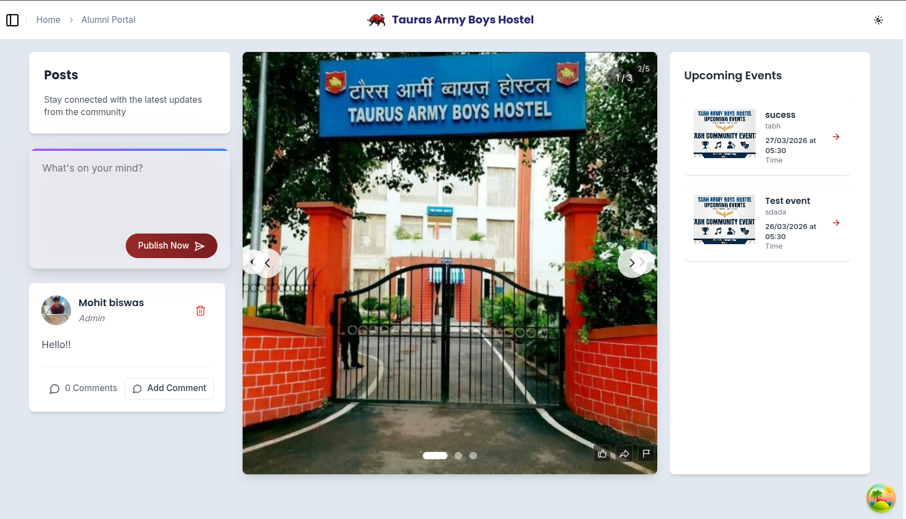

# Tauras Army Boys Hostel (TABH) Portal

This is the official repository for the TABH Hostel Portal.
The project aims to connect former hostelers, foster brotherhood, and facilitate communication
between former residents and the current hostel community.

## Project Structure

```plaintext
TABH-Portal/
├── FRONTEND/                # Next.js app (Application Root)
│   ├── src/                 # Application source code
│   │   ├── app/             # API Routes & Pages (Next.js App Router)
│   │   ├── components/      # React components
│   │   ├── contexts/        # Auth & Global contexts
│   │   ├── hooks/           # TanStack Query & Custom hooks
│   │   └── lib/             # Firebase & Axios utilities
│   ├── public/              # Static assets
│   └── ...                  # Config files (package.json, tailwind.config.js)
├── LICENSE                  # License information
└── README.md                # Project documentation
```

## Tech Stack

- **Frontend**: Next.js (React)
- **Backend/API**: Next.js API Routes (Serverless)
- **Authentication**: Firebase Authentication (Email/Password & Google OAuth)
- **Database**: Firebase Firestore (NoSQL)
- **Storage**: Firebase Storage (for media and documents)
- **State Management**: TanStack Query (React Query)
- **Styling**: Tailwind CSS & Framer Motion

## Admin Access
- To access administrative features (e.g., adding events, posting jobs), log in with:
  - **Email**: `mohitkumarbiswas9@gmail.com`
  - This user is automatically assigned the **Admin Role** and has exclusive write access to Events and Jobs.

## Getting Started

### Prerequisites

Ensure you have the following installed:

- [Node.js and npm](https://nodejs.org/)
- [Git](https://git-scm.com/)

### Installation

1. **Clone the repository:**

   ```bash
   git clone https://github.com/atik65/TABH-Portal.git
   cd TABH-Portal
   ```

2. **Application Setup**:

   - Navigate to the `FRONTEND` folder:

     ```bash
     cd FRONTEND
     ```

   - Install dependencies:

     ```bash
     npm install
     ```

   - Set up environment variables:
     Create a `.env.local` file in the `FRONTEND` directory with your Firebase credentials:
     ```env
     NEXT_PUBLIC_FIREBASE_API_KEY=your_api_key
     NEXT_PUBLIC_FIREBASE_AUTH_DOMAIN=your_auth_domain
     NEXT_PUBLIC_FIREBASE_PROJECT_ID=your_project_id
     NEXT_PUBLIC_FIREBASE_STORAGE_BUCKET=your_storage_bucket
     NEXT_PUBLIC_FIREBASE_MESSAGING_SENDER_ID=your_sender_id
     NEXT_PUBLIC_FIREBASE_APP_ID=your_app_id
     FIREBASE_ADMIN_PROJECT_ID=your_admin_project_id
     FIREBASE_ADMIN_CLIENT_EMAIL=your_admin_client_email
     FIREBASE_ADMIN_PRIVATE_KEY="your_admin_private_key"
     ```

     > [!WARNING]
     > Never commit your `.env` files (like `.env.local`) or `serviceAccountKey.json` to GitHub as they contain sensitive API keys. They have been added to `.gitignore` to prevent accidental uploads.

   - Start the development server:

     ```bash
     npm run dev
     ```

   The portal should now be accessible at `http://localhost:3000`.

## Architecture

The project has been migrated from a Django + SQLite monolith to a modern serverless architecture using **Next.js API Routes** and **Firebase**.

- **Authentication**: Custom AuthProvider using Firebase Client SDK.
- **API Security**: Next.js API routes verify Firebase ID tokens using the Admin SDK.
- **Data Persistence**: Firestore is used for all records (Users, Posts, Events, Mentors).
- **Public Access**: Specific sections (Home, Resources) are accessible without login, while administrative and social features require authenticated @vipstc.edu.in accounts.

## **User Interface**

## UI Screenshots




## Contributing

1. Fork the repository.
2. Create a new branch (`git checkout -b feature/your-feature`).
3. Make your changes.
4. Commit your changes (`git commit -m 'Add some feature'`).
5. Push to the branch (`git push origin feature/your-feature`).
6. Open a pull request.

## License

This project is licensed under the MIT License. See the [LICENSE](LICENSE) file for details.

## Acknowledgments

Special thanks to TABH for supporting this project.

---

**Note**: For production deployment, ensure that sensitive information is kept secure and follow best practices for environment setup, such as configuring a production-ready database and securing API endpoints.
