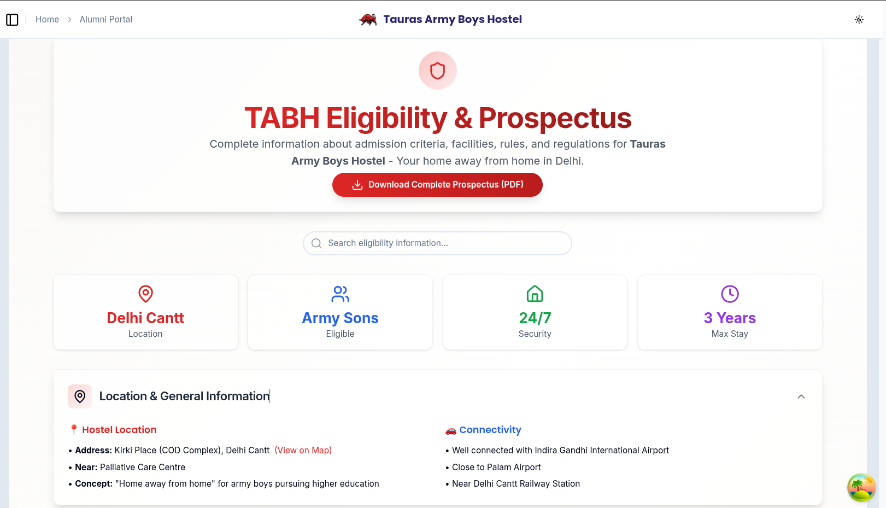
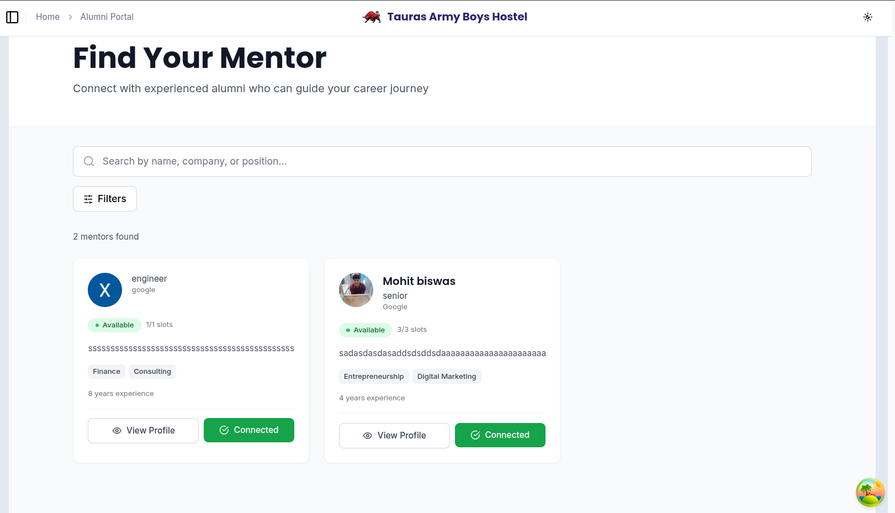
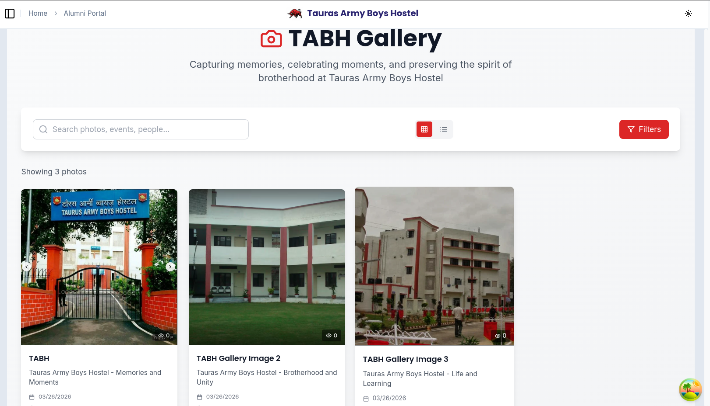
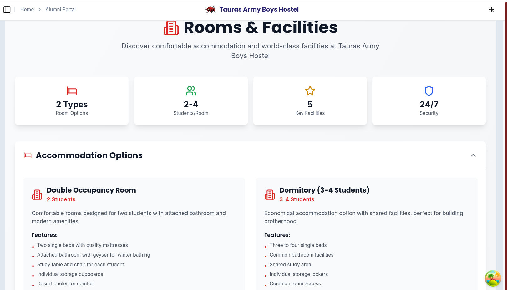
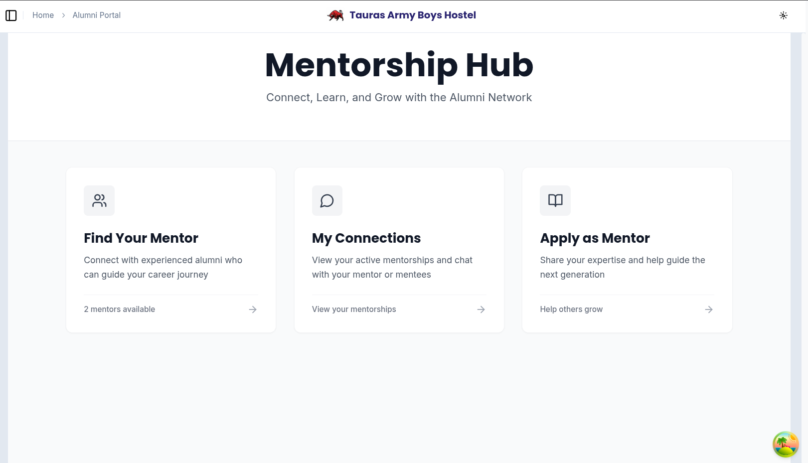

# Tauras Army Boys Hostel (TABH) Portal

This is the official repository for the TABH Hostel Portal.
The project aims to connect former hostelers, foster brotherhood, and facilitate communication
between former residents and the current hostel community.

## Project Structure

```plaintext
TABH-Portal/
├── FRONTEND/                # Next.js app (Application Root)
│   ├── src/                 # Application source code
│   │   ├── app/             # API Routes & Pages (Next.js App Router)
│   │   ├── components/      # React components
│   │   ├── contexts/        # Auth & Global contexts
│   │   ├── hooks/           # TanStack Query & Custom hooks
│   │   └── lib/             # Firebase & Axios utilities
│   ├── public/              # Static assets
│   └── ...                  # Config files (package.json, tailwind.config.js)
├── LICENSE                  # License information
└── README.md                # Project documentation
```

## Tech Stack

- **Frontend**: Next.js (React)
- **Backend/API**: Next.js API Routes (Serverless)
- **Authentication**: Firebase Authentication (Email/Password & Google OAuth)
- **Database**: Firebase Firestore (NoSQL)
- **Storage**: Firebase Storage (for media and documents)
- **State Management**: TanStack Query (React Query)
- **Styling**: Tailwind CSS & Framer Motion

## Admin Access
- To access administrative features (e.g., adding events, posting jobs), log in with:
  - **Email**: `mohitkumarbiswas9@gmail.com`
  - This user is automatically assigned the **Admin Role** and has exclusive write access to Events and Jobs.

## Getting Started

### Prerequisites

Ensure you have the following installed:

- [Node.js and npm](https://nodejs.org/)
- [Git](https://git-scm.com/)

### Installation

1. **Clone the repository:**

   ```bash
   git clone https://github.com/atik65/TABH-Portal.git
   cd TABH-Portal
   ```

2. **Application Setup**:

   - Navigate to the `FRONTEND` folder:

     ```bash
     cd FRONTEND
     ```

   - Install dependencies:

     ```bash
     npm install
     ```

   - Set up environment variables:
     Create a `.env.local` file in the `FRONTEND` directory with your Firebase credentials:
     ```env
     NEXT_PUBLIC_FIREBASE_API_KEY=your_api_key
     NEXT_PUBLIC_FIREBASE_AUTH_DOMAIN=your_auth_domain
     NEXT_PUBLIC_FIREBASE_PROJECT_ID=your_project_id
     NEXT_PUBLIC_FIREBASE_STORAGE_BUCKET=your_storage_bucket
     NEXT_PUBLIC_FIREBASE_MESSAGING_SENDER_ID=your_sender_id
     NEXT_PUBLIC_FIREBASE_APP_ID=your_app_id
     FIREBASE_ADMIN_PROJECT_ID=your_admin_project_id
     FIREBASE_ADMIN_CLIENT_EMAIL=your_admin_client_email
     FIREBASE_ADMIN_PRIVATE_KEY="your_admin_private_key"
     ```

     > [!WARNING]
     > Never commit your `.env` files (like `.env.local`) or `serviceAccountKey.json` to GitHub as they contain sensitive API keys. They have been added to `.gitignore` to prevent accidental uploads.

   - Start the development server:

     ```bash
     npm run dev
     ```

   The portal should now be accessible at `http://localhost:3000`.

## Automation & Architecture

To make the platform robust, scalable, and secure, several automated systems and architectural migrations were implemented:

- **Serverless Architecture Migration**: The project was migrated from a Python Django + SQLite monolith to a modern serverless architecture using **Next.js API Routes** and **Firebase** (Firestore, Storage, Authentication). This ensures automatic horizontal scaling, zero-downtime deployments, and high availability.
- **Automated Authentication & API Security**: Custom `AuthProvider` using Firebase Client SDK. Route protection is fully automated via Next.js middleware. Next.js API routes securely verify Firebase ID tokens using the Admin SDK.
- **Automated Content Filtering**: The backend/API automatically filters database queries based on an `is_public` flag. This allows administrators to post content safely and let the system automatically deliver it to public visitors or exclusively to authenticated members.
- **Role-Based Access Control (RBAC)**: Automated assignment of "Admin" roles to specific, verified email handles (e.g., `mohitkumarbiswas9@gmail.com`). This automation dictates write-capabilities for creating events, managing job posts, and altering core data.
- **Data Persistence**: Firestore NoSQL databases are utilized for all persistent records (Users, Posts, Events, Mentors, Content).

## Code Structure & Modules Elaboration

The TABH codebase strongly utilizes the Next.js App Router, heavily modularizing logic into discrete features. The modules correspond closely to the user interfaces and APIs, strictly categorized into two main segments:

### A. Public Modules (No Login Required)
These modules exist to inform prospective hostelers and the general internet public.
- **Home & About TABH**: The landing pages detailing the hostel's history and mission.
- **Gallery & Blogs**: Visual and narrative showcases of hostel life, strictly filtered for public viewing.
- **Resources**: Centralized repository of downloadable documents, rules, guidelines, and reading materials.
- **Eligibility & Admissions**: Outlines admission criteria and processes.
- **Rooms & Facilities**: Details the living conditions and infrastructural amenities.
- **Contact**: Secure public interface for inquiries.

### B. Private / Authenticated Modules (Portal Dashboard)
These modules reside under the `FRONTEND/src/app/portal/*` directory and rigorously require an authenticated session via a valid `@vipstc.edu.in` account or an approved registration.
- **Portal Dashboard & Profile**: Personalized landing area summarizing the latest network activities.
- **Alumni & Hostelers Directory**: Searchable databases connecting past and present residents globally.
- **Mentorship System**: Allows experienced alumni to mentor current students. Mentors apply via automated multi-step forms that process and persistently store progressive applicant data, streamlining mentor-mentee pairing.
- **Job Postings**: Career vacancy and referral system shared exclusively over the TABH brotherhood network.
- **Member Events & Committee**: Secure space tracking exclusive gatherings, transparent discussions, and maintaining committee affairs.
- **Admin Panel**: An exclusive interface built strictly for platform administrators managing user approvals, role assignments, system-wide public/private toggles, and ensuring platform integrity.

## **User Interface**

## UI Screenshots








## Contributing

1. Fork the repository.
2. Create a new branch (`git checkout -b feature/your-feature`).
3. Make your changes.
4. Commit your changes (`git commit -m 'Add some feature'`).
5. Push to the branch (`git push origin feature/your-feature`).
6. Open a pull request.

## License

This project is licensed under the MIT License. See the [LICENSE](LICENSE) file for details.

## Acknowledgments

Special thanks to TABH for supporting this project.

---

**Note**: For production deployment, ensure that sensitive information is kept secure and follow best practices for environment setup, such as configuring a production-ready database and securing API endpoints.
